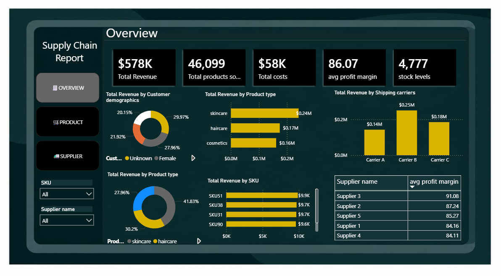
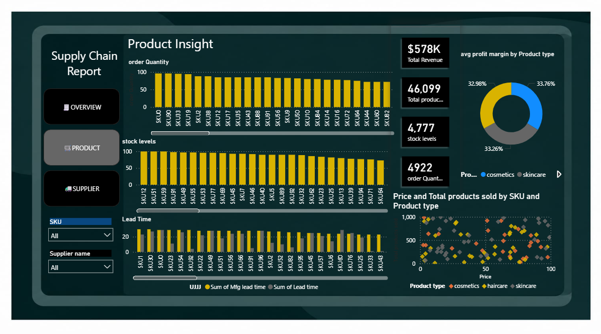
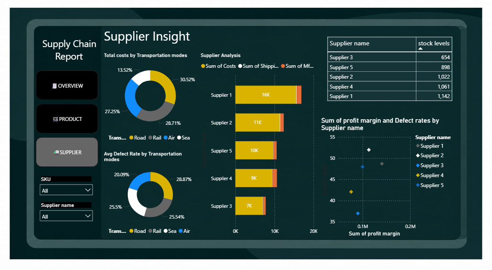

# 🚚 Supply Chain Performance Dashboard

## 📌 Project Overview

This project analyzes supply chain performance using Microsoft Power BI.

The dashboard provides insights into revenue, products, inventory, suppliers,
transportation costs, profit margins, defect rates, order quantities, and lead times.

The goal is to help business stakeholders understand supply chain performance
and identify areas that may require attention.

---

## 🛠️ Tools Used

- Microsoft Power BI
- Power Query
- DAX
- Data Visualization

---

## 📊 Dashboard Pages

### 1. Overview

The Overview dashboard provides a high-level view of supply chain performance.

**Key KPIs:**
- Total Revenue: $578K
- Total Products Sold: 46,099
- Total Costs: $58K
- Average Profit Margin: 86.07
- Stock Levels: 4,777

**Visualizations include:**
- Revenue by customer demographics
- Revenue by product type
- Revenue by shipping carrier
- Revenue by SKU
- Average profit margin by supplier
- Product type distribution

---

### 2. Product Insight

The Product Insight dashboard focuses on product-level performance.

**Key metrics:**
- Total Revenue: $578K
- Total Products Sold: 46,099
- Stock Levels: 4,777
- Order Quantity: 4,922

**Analysis includes:**
- Order quantity by SKU
- Stock levels by SKU
- Lead time by SKU
- Average profit margin by product type
- Price and products sold by SKU
- Product type analysis

---

### 3. Supplier Insight

The Supplier Insight dashboard focuses on supplier and transportation performance.

**Analysis includes:**
- Total costs by transportation mode
- Supplier cost analysis
- Supplier stock levels
- Defect rate by transportation mode
- Supplier profit margin and defect rate
- Supplier comparison

---

## 🎯 Business Questions

- Which product types generate the most revenue?
- Which suppliers have higher profit margins?
- Which transportation modes contribute the most to costs?
- Which transportation modes have higher defect rates?
- How do supplier profit margins compare with defect rates?
 
---

## 💡 Key Insights

- Total revenue generated is approximately $578K.
- The dashboard records 46,099 total products sold.
- Total costs are approximately $58K.
- Current stock levels are 4,777.
- Supplier 3 has the highest average profit margin shown in the supplier table.
- Supplier 1 has the highest stock level among the suppliers shown.
- Carrier B generates the highest revenue among the shipping carriers shown.
- Skincare generates the highest revenue among the product types shown.
- Transportation modes have different cost and defect-rate contributions, which can be compared using the Supplier Insight dashboard.

---

## 📈 Dashboard Screenshots

### Overview

### Product Insight

### Supplier Insight

---

## 🎯 Business Recommendations

- Review transportation modes with higher costs to identify opportunities for cost reduction.
- Monitor suppliers with higher defect rates and lower profit margins to improve supplier performance.
- Monitor products and suppliers with high stock levels to reduce excess inventory.
- Review products with longer lead times to identify potential supply delays.
- Regularly monitor key KPIs such as revenue, stock levels, defect rates, profit margin, and lead time.

---

## 👨‍💻 Project Objective

The objective of this project is to demonstrate how Power BI can be used
to transform supply chain data into an interactive business intelligence
dashboard and support data-driven decision making.
